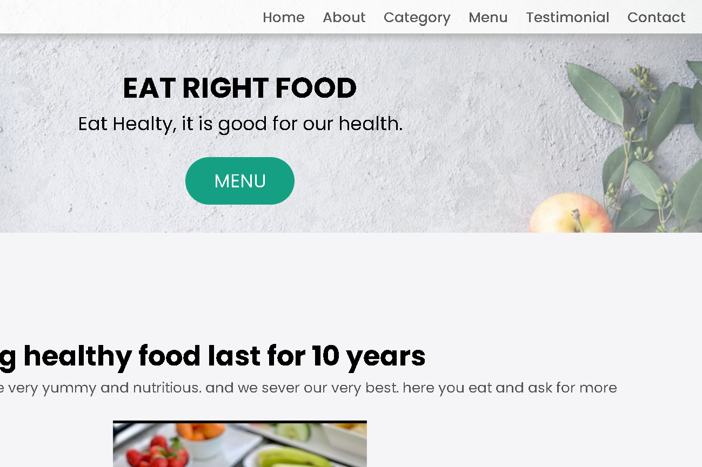

- Home page
# README for Portfolio Homepage

## Overview

This is a personal portfolio website for Assumpta Chinonso, a frontend developer. The site showcases her skills, projects, and contact information, built using HTML5, CSS3, and Bootstrap.

## Project Structure

```
├── index.html
├── about.html
├── portfolio.html
├── contact.html
├── images/
├── css/
├── bootstrap/
├── fonts/
├── js/
└── plugins/
```

## Technologies Used

- HTML5
- CSS3
- Bootstrap
- JavaScript
- jQuery
- Font Awesome
- Google Fonts

## Features

- Responsive Design
- Smooth Scroll
- Animations
- Portfolio Showcase
- Contact Form

## Setup and Installation

1. Clone the repository:
   ```sh
   git clone https://github.com/Assumpta-Chinonso1/portfolio-website.git
   cd portfolio-website
   ```

2. Open `index.html` in your web browser.

## Usage

- Navigate using the menu to browse different sections.
- View portfolio projects in the `Portfolio` section.
- Use the about in the `About` section to know more about me and my skills
- Use the contact form in the `Contact` section to get in touch.

## Customization

- Update content in HTML files.
- Modify styles in CSS files.
- Adjust interactive features in JavaScript files.

## Contact

For questions or feedback, contact Assumpta Chinonso:
- [GitHub](https://github.com/Assumpta-Chinonso1)
- [Email](assumptachinonso42@gmail.com)

  


- Contact page

# README for Contact Page

## Overview

This is the contact page for Assumpta Chinonso's portfolio website. It allows visitors to reach out with inquiries or project opportunities. The page is built using HTML5, CSS3, and Bootstrap.

## Project Structure

```
├── contact.html
├── images/
├── css/
├── bootstrap/
├── fonts/
├── js/
└── plugins/
```

## Technologies Used

- HTML5
- CSS3
- Bootstrap
- JavaScript
- jQuery
- Font Awesome
- Google Fonts

## Features

- Contact Form
- Contact Information
- Social Media Links
- Responsive Design

## Setup and Installation

1. Clone the repository:
   ```sh
   git clone https://github.com/Assumpta-Chinonso1/portfolio-website.git
   cd portfolio-website
   ```

2. Open `contact.html` in your web browser.

## Usage

- Fill out the contact form to send a message.
- Use provided contact details and social media links to connect.

## Contact

For questions or feedback, contact Assumpta Chinonso:
- [GitHub](https://github.com/Assumpta-Chinonso1)
- [Email](assumptachinonso42@gmail.com)

  - contact form


- About page
       
       # README for About Page

## Overview

This is the About Me page for Assumpta Chinonso's portfolio website, detailing my skills and experience as a Front-End Developer.

## Project Structure

```
├── about.html
├── images/
├── css/
├── bootstrap/
├── fonts/
├── js/
└── plugins/
```

## Technologies Used

- HTML5
- CSS3
- Bootstrap
- JavaScript
- jQuery
- Font Awesome
- Google Fonts

## Features

- Personal Introduction
- Skill Highlights
- Responsive Design

## Setup and Installation

1. Clone the repository:
   ```sh
   git clone https://github.com/Assumpta-Chinonso1/portfolio-website.git
   cd portfolio-website
   ```

2. Open `about.html` in your web browser.

## Usage

- Learn about Assumpta's background and skills.
- Contact information and social media links are provided.

## Contact

For questions or feedback, contact Assumpta Chinonso:
- [GitHub](https://github.com/Assumpta-Chinonso1)
- [Email](assumptachinonso42@gmail.com)


  
- Portfolio


# My Capstone Portfolio

Welcome to my Capstone Portfolio! This project showcases my work and skills through various web development projects. Each project demonstrates different aspects of my abilities in front-end development using HTML, CSS, JavaScript, and various frameworks and libraries.

## Table of Contents

- [Live Demo](#live-demo)
- [Features](#features)
- [Technologies Used](#technologies-used)
- [Projects](#projects)
- [Installation](#installation)
- [Usage](#usage)
- [Contributing](#contributing)
- [License](#license)
- [Contact](#contact)

## Live Demo

You can view the live version of this portfolio [here](https://c9-portfolio-beta.vercel.app/).

## Features

- Responsive design ensuring optimal viewing on various devices.
- Clean and modern user interface.
- Navigation bar for easy access to different sections.
- Showcase of multiple projects with links to live demos.
- Detailed project descriptions.
- Contact information.

## Technologies Used

- **HTML5**: For structuring the content on the web.
- **CSS3**: For styling the content, making it visually appealing.
- **Bootstrap**: For responsive design and pre-styled components.
- **JavaScript**: For interactive elements and dynamic content.
- **jQuery**: For simplified JavaScript operations.
- **Isotope**: For filtering and sorting project items.
- **Netlify**: For deploying the live version of the portfolio.

## Projects

### Project 1: Shopping List
A simple shopping list application to keep track of items to buy.
- **Live Demo**: [Shopping List](https://calm-quokka-9028e9.netlify.app/)
- **Technologies**: HTML, CSS, JavaScript
- **Screenshot**: 

### Project 2: Susu's Vanilla Js Todo
A basic to-do list application using vanilla JavaScript.
- **Live Demo**: [Susu's Vanilla Js Todo](https://musical-pony-5be72a.netlify.app/)
- **Technologies**: HTML, CSS, JavaScript
- **Screenshot**: 

### Project 3: Multi-step Form
A multi-step form for collecting user information in stages.
- **Live Demo**: [Multi-step Form](https://zesty-crisp-491624.netlify.app/)
- **Technologies**: HTML, CSS, JavaScript


### Project 4: Palindrome Checker
An application to check if a given string is a palindrome.
- **Live Demo**: [Palindrome Checker](https://sparkly-sopapillas-750d35.netlify.app/)
- **Technologies**: HTML, CSS, JavaScript

### Project 5: Chuks Noris Jokes
A fun application that fetches Chuck Norris jokes from an API.
- **Live Demo**: [Chuks Noris Jokes](https://thriving-fenglisu-7a85c6.netlify.app/)
- **Technologies**: HTML, CSS, JavaScript

### Project 6: Thank You Submission Button
A button that shows a thank you message upon submission.
- **Live Demo**: [Thank You Button](https://friendly-faloodeh-8a606c.netlify.app/)
- **Technologies**: HTML, CSS, JavaScript

### Project 7: Simple Calculator
A basic calculator for performing simple arithmetic operations.
- **Live Demo**: [Simple Calculator](https://comforting-entremet-df20d1.netlify.app/)
- **Technologies**: HTML, CSS, JavaScript


### Project 8: Food Website
A website template for a food-related business.
- **Live Demo**: [Food Website](https://musical-alfajores-03fa1b.netlify.app/)
- **Technologies**: HTML, CSS, JavaScript

- **Screenshot** 


### Project 9: Simple Form Registration
A simple form registration page.
- **Live Demo**: [Form Registration](https://codepen.io/assumptachinonso/pen/qBwJqBo)
- **Technologies**: HTML, CSS, 

## Installation

To run this project locally, follow these steps:

1. **Clone the repository:**
   ```sh
   git clone https://github.com/Assumpta-Chinonso1/c9_portfolio.git
   ```
2. **Navigate to the project directory:**
   ```sh
   cd your-portfolio-repo
   ```

## Usage

Open the `index.html` file in your preferred web browser to view the portfolio. Navigate through the projects and explore the live demos using the provided links.

## Contributing

Contributions are welcome! If you have suggestions or improvements, please follow these steps:

1. Fork the repository.
2. Create a new branch (`git checkout -b feature-branch`).
3. Commit your changes (`git commit -m 'Add some feature'`).
4. Push to the branch (`git push origin feature-branch`).
5. Open a pull request.

## License

This project is licensed under the MIT License - see the [LICENSE](LICENSE) file for details.

## Contact

If you have any questions or feedback, feel free to reach out to me:

- **Name**: Assumpta Chinonso
- **Email**: [your-email@example.com](assumptachinonso42@gmail.com.com)
- **LinkedIn**: [Your LinkedIn Profile](https://www.linkedin.com/in/assumpta-chinonso-6a7355239/)
- **GitHub**: [Your GitHub Profile](https://github.com/Assumpta-Chinonso1)

---


  
